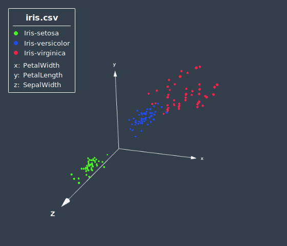
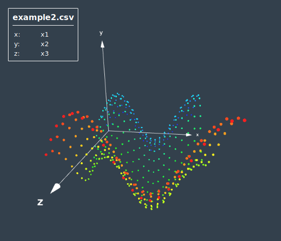
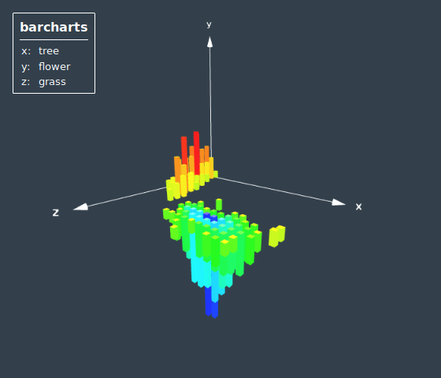
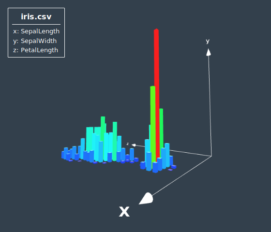

**unstable**

Plots functions and .csv files. Based on three.js.

It is written in ES6 syntax and compiled using Webpack.

default branch: "threejs"

    
    
    
    

## Building JsPlot3D.js

    npm install
    npm start
    #3JsPlot3D.js is now created in compiled/JsPlot3D.js
    #to minify the file, add the -p parameter to webpack in scripts.start in package.json

## How to Use

first, you need to build. See above.
    
JsPlot3D.js will then be created in compiled/ automatically
    
Take a look into the sourcode of the files in examples, especially in examples/test. There are 4 files a.html, b.html, c.html and d.html which contain a few examples.

## Features

- optimized for animations
- scatterplots
- coloring datalabels
- heatmaps
- validates and plots formulas (supports polygons as output)
- barcharts
- creating legends
- reads .csv files

## Live Example

I'm going to put a live example online once all high priority features are complete. In the meantime you can use it like this:

first, you need to build. See above.

open examples/index.html in your browser for a live example.

Example for f(x1,x2):

    (cos(x1*10+sin(x2*10)))*0.3

    (Math.cos(x1*10)+Math.sin(x2*10))*0.2

    tanh(x1)! ^ (x2 + sqrt(2))*2 + ln(sin(x2) + e)*2 - π*1.1

It has to be in JavaScript syntax, but some common functions are also supported in regular mathematical syntax. the ^ XOR Operator does not work anymore this way though

Take one of the csvs in /examples/csvFiles or get a .csv dataset (for example on kaggle.com) and upload it to the upload button of the live example. Type in the indices of the .csv file columns that are used as datapoint dimensions

## Todo

**needed for a first release:**

- make a nice live example on a webspace.
- make it easy to use as a framework and make a doku for it with some examples
- make a bundle without three.js, so that users don't link three.js twice if they already have it

**what else is there to do:**

- calculate the average color per bar (which are sums of y values that are near that grid position) depending on colorCol. At the moment it only dyes according to the y-height
- how is the performance for very large dataframes? base64 decoding the uplaoded file takes ages and I can't change that. what about the plotting and data processing?
- increase barchart performance. e.g. by adding the option to define the normalization ranges (min and max) yourself (so that the tool does has to calculate it on its own), and also when plotting formulas, data gets transformed to a dataframe and then transformed to a "x,z -> y" kind of 2D array, maybe there is a way to just directly calculate the 2D array, hand it over to PlotDataFrame, which then ignores the df variable. Also make sure to cache that aswell.
- add an utility that lets you convert csvs and json objects to dataframes according to a configuration. Then the user can input that into PlotDataFrame. This approach would result in a more clean overall tool i think.
- add a isometric ortographic mode
- csvplot: add a mode called "wire". Instead of sprites, connect each datapoint to a wire that goes through all the points, from the first point in the dataframe to the last
- support writing the colum header name as x1col x2col x3col and colorCol
- on submit csvform plot the scatterplot in examples/index.html
- display box around the plot that has inverse culling, so that the viewer can look inside it. Display a grid texture on it's faces.
- for recursive formulas, use scatterplot and plot a datapoint everytime f(x1,x2) gets called. Datapoints, that have been calculated already at some point, are already cached (helps to stop recursion overflows and increases performance)
- for recursive formulas, offer some start value setter
- maybe there is some way of creating a polygon from unevenly distributed datapoints. (imagine an island floating somewhere that is made up of datapoints and then connect that to a mesh)
- heatmapcolor it according to function height (for polygons)

## Creating a doc from the javadoc

    npm install jsdoc -g
    #I had to reboot once afterswards to use the jsdoc command
    jsdoc src/JsPlot3D.js -d ./documentation

## Attribution

iris.csv Dataset by Ronald Fisher

Codystar font by Neapolitan Principal design https://fonts.google.com/specimen/Codystar, released under the Open Font License